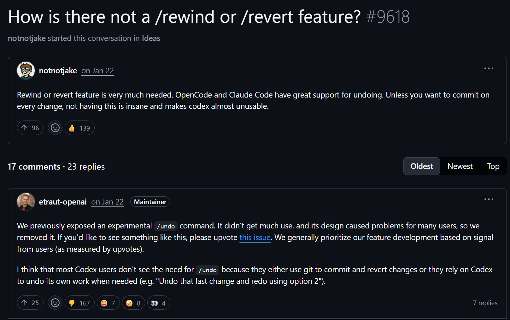

# Checkpoint

一个本地 Git 快照工具，设计用来给 Codex 擦屁股，不过任何有 Git 的项目都能手动使用，也可以接入支持 HTTP MCP 的其他工具。

基本用法就是在 AI 改代码前留个快照，改坏了随时恢复。

快照会保存已暂存、未暂存和未被忽略的新文件。恢复时不会移动 `HEAD`、切换分支或修改 stash，恢复操作并不会删除快照，你可以在任意快照间随意切换。

## 使用

目前支持 Windows，需要本机已安装 Git。

```powershell
flutter run -d windows
```

也可以直接打开指定仓库：

```powershell
checkpoint.exe C:\path\to\repository
```

打开仓库后，点击“创建快照”即可。需要回退时选中快照并还原。

## Codex 自动保存

应用内可以安装附带的 Codex 插件。安装后，插件会在会话开始时向模型提供自动保存规则；模型会在回复前主动创建一次快照，不再注册结束对话时的 Stop 钩子。

安装后需要重启 Codex；自动保存期间需要保持 Checkpoint 运行。

## MCP

Checkpoint 运行时会在本机提供 MCP 服务：

```text
http://127.0.0.1:47173/mcp
```

提供两个工具：

- `checkpoint_create_snapshot`：创建快照
- `checkpoint_get_latest_snapshot`：查询最新快照

把这个地址配进任何支持 HTTP MCP 的客户端即可使用。

## PI 自动保存扩展

应用导出的插件目录还包含 `pi/checkpoint-autosave.ts`，用于 [PI 扩展](https://pi.dev/docs/latest/extensions)。
把它复制到 `~/.pi/agent/extensions/checkpoint-autosave.ts`（或项目的 `.pi/extensions/`）后，PI 会在每次
发送用户提示前把自动保存规则注入系统上下文。规则要求 AI 在完成改动和验证后、回复前自行调用
`checkpoint_create_snapshot`。PI 扩展只注册这个 MCP 代理工具，不执行 Git 状态检测，也不在
`agent_end` 等生命周期事件中自动创建快照。

PI 扩展只依赖 PI 提供的 TypeScript 运行时和 Node.js 内置模块；使用前请保持 Checkpoint 桌面程序运行。

## 注意

- 仓库至少要有一次提交。
- `.gitignore` 排除的文件不会进入快照。
- 恢复会覆盖当前未提交修改，并清理未被忽略的未跟踪文件。
- 快照适合临时兜底，长期保存仍然应该正常 commit。
- 自动保存规则不会创建 Git commit；除非用户明确要求，否则 AI 不应提交 commit。

## 开发

```powershell
flutter pub get
flutter test
flutter analyze
```
